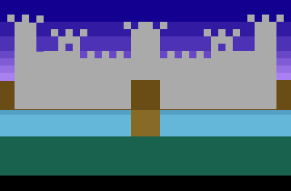

# Atari 2600 Tests

An assortment of test programs I've created while learning how to program the 6502 processor for the Atari 2600.

# Tests

[Test 1](test-01.asm) - Simple test painting the screen blue

[Test 2](test-02.asm) - Gradient background

[Test 3](test-03.asm) - Gradient background with color data and nested scanline loop

[Test 4](test-04.asm) - Castle with moat and drawbridge using reflected playfield

## Tutorials

+ [Andrew Davie's Atari 2600 Programming Tutorial](http://atariage.com/forums/topic/33233-sorted-table-of-contents/) - The best introduction to Atari 2600 and 6502 programming.
+ [2600 101 by Kirk Isreal](http://www.alienbill.com/2600/101/) - More useful basics and examples.
+ [Stella Programmer's Guide by Steve Wright](http://www.alienbill.com/2600/101/docs/stella.html)
+ [6502 Tutorials](http://www.6502.org/tutorials/)

## Tools

+ [WUSDN IDE](http://www.wudsn.com/index.php/ide) - A free integrated Apple II, Atari 2600, Atari 7800, Atari 8-bit, C64 and NES development plugin for Eclipse.
+ [6502 Compilers](http://www.wudsn.com/productions/java/ide/downloads/compilers.zip) - Collection of compilers, including DASM needed for WUSDN IDE.
+ [Stella](http://stella.sourceforge.net/) - Atari 2600 emulator to run ROMS I created.

# License

Copyright 2017 James O'Reilly

Licensed under the Apache License, Version 2.0 (the "License");
you may not use this file except in compliance with the License.
You may obtain a copy of the License at

[http://www.apache.org/licenses/LICENSE-2.0](http://www.apache.org/licenses/LICENSE-2.0)

Unless required by applicable law or agreed to in writing, software
distributed under the License is distributed on an "AS IS" BASIS,
WITHOUT WARRANTIES OR CONDITIONS OF ANY KIND, either express or implied.
See the License for the specific language governing permissions and
limitations under the License.
